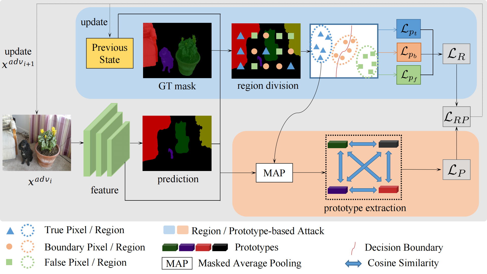

# RP-PGD & RP-PGD++
A Region-and-Prototype-Based Adversarial Attack to Enhance the Robustness of Segmentation Models



This is the official project of our work AAAI work RP-PGD ([paper](https://ojs.aaai.org/index.php/AAAI/article/view/33122)) and its enhanced version RP-PGD++ (under review).

## Project Setup
To install the environment of the project, please install Python 3 and PyTorch with Anaconda:
```shell
conda create --name rppgd python=3.8
conda activate rppgd
```

Then clone this repo and install the corresonding requirements:
```shell
git clone --recursive git@github.com:yuxuan357/RP-PGD.git
cd RP-PGD
pip install -r requirements.txt
```

## Hardware Requirement
We strongly recommend utilizing 4 to 8 GPUs, each equipped with >= 24GB memory (such as NVIDIA RTX 4090 GPUs), for optimal performance.

## Training
The dataset Pascal VOC, Cityscapes, and ADE20k can be downloaded from the website as follows:

1) Pascal VOC: http://host.robots.ox.ac.uk/pascal/VOC/voc2012/ (with SBD augmentation);
2) Cityscapes: https://www.cityscapes-dataset.com/;
3) ADE20k: https://ade20k.csail.mit.edu/

Change the data root of these datasets in the config files.

For pre-trained backbone, please refer to the readme in ``initmodel" to download the weight of the initial checkpoint pretrained on ImageNet.

- Adversarially train PSPNet with RP-PGD++ on Pascal VOC:

  ```shell
  sh tool_train/voc2012/psp_train_sat.sh
  ```

- Adversarially train PSPNet with RP-PGD++ on Cityscapes:

  ```shell
  sh tool_train/cityscapes/psp_train_sat.sh
  ```

- Adversarially train PSPNet with RP-PGD++ on ADE20k:

  ```shell
  sh tool_train/ade20k/psp_train_sat.sh
  ```

- Adversarially train DeepLabv3 with RP-PGD++ on Pascal VOC:

  ```shell
  sh tool_train/voc2012/aspp_train_sat.sh
  ```

- Adversarially train DeepLabv3 with RP-PGD++ on Cityscapes:

  ```shell
  sh tool_train/cityscapes/aspp_train_sat.sh
  ```

- Adversarially train DeepLabv3 with RP-PGD++ on ADE20k:

  ```shell
  sh tool_train/ade20k/aspp_train_sat.sh
  ```

  ## Test

  - Evaluate the PSPNet AT with RP-PGD++ on Pascal VOC:

  ```shell
  sh tool_test/voc2012/psp_test_sat.sh
  ```

- Evaluate the PSPNet AT with RP-PGD++ on Cityscapes:

  ```shell
  sh tool_test/cityscapes/psp_test_sat.sh
  ```

- Evaluate the PSPNet AT with RP-PGD++ on ADE20k:

  ```shell
  sh tool_test/ade20k/psp_test_sat.sh
  ```

- Evaluate the DeepLabv3 AT with RP-PGD++ on Pascal VOC:

  ```shell
  sh tool_test/voc2012/aspp_test_sat.sh
  ```

- Evaluate the DeepLabv3 AT with RP-PGD++ on Cityscapes:

  ```shell
  sh tool_test/cityscapes/aspp_test_sat.sh
  ```

- Evaluate the DeepLabv3 AT with RP-PGD++ on ADE20k:

  ```shell
  sh tool_test/ade20k/aspp_test_sat.sh
  ```
